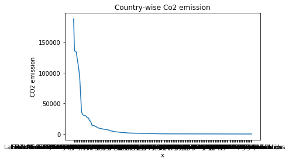
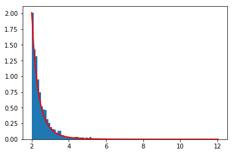

```python
import pandas as pd
co2data = pd.read_csv("./Co2Data.csv", index_col = "Country Name")
co2data = co2data.loc["Afghanistan":"Zimbabwe", "1990":"2012"]
co2data = co2data.dropna()
co2data.head()
```


<div>
<table border="1" class="dataframe">
  <thead>
    <tr style="text-align: right;">
      <th></th>
      <th>1990</th>
      <th>1991</th>
      <th>1992</th>
      <th>1993</th>
      <th>1994</th>
      <th>1995</th>
      <th>1996</th>
      <th>1997</th>
      <th>1998</th>
      <th>1999</th>
      <th>...</th>
      <th>2003</th>
      <th>2004</th>
      <th>2005</th>
      <th>2006</th>
      <th>2007</th>
      <th>2008</th>
      <th>2009</th>
      <th>2010</th>
      <th>2011</th>
      <th>2012</th>
    </tr>
    <tr>
      <th>Country Name</th>
      <th></th>
      <th></th>
      <th></th>
      <th></th>
      <th></th>
      <th></th>
      <th></th>
      <th></th>
      <th></th>
      <th></th>
      <th></th>
      <th></th>
      <th></th>
      <th></th>
      <th></th>
      <th></th>
      <th></th>
      <th></th>
      <th></th>
      <th></th>
      <th></th>
    </tr>
  </thead>
  <tbody>
    <tr>
      <th>Afghanistan</th>
      <td>2614.571000</td>
      <td>2438.555000</td>
      <td>1393.460000</td>
      <td>1345.789000</td>
      <td>1294.451000</td>
      <td>1243.113000</td>
      <td>1177.107000</td>
      <td>1096.433</td>
      <td>1041.428</td>
      <td>821.408</td>
      <td>...</td>
      <td>1195.442</td>
      <td>949.753</td>
      <td>1327.454</td>
      <td>1650.150</td>
      <td>2273.540</td>
      <td>4206.049</td>
      <td>6769.282</td>
      <td>8463.436</td>
      <td>12240.446</td>
      <td>10755.311</td>
    </tr>
    <tr>
      <th>Angola</th>
      <td>5115.465000</td>
      <td>5089.796000</td>
      <td>5196.139000</td>
      <td>5775.525000</td>
      <td>3890.687000</td>
      <td>10975.331000</td>
      <td>10458.284000</td>
      <td>7381.671</td>
      <td>7308.331</td>
      <td>9156.499</td>
      <td>...</td>
      <td>9064.824</td>
      <td>18793.375</td>
      <td>19156.408</td>
      <td>22266.024</td>
      <td>25151.953</td>
      <td>25709.337</td>
      <td>27792.193</td>
      <td>29057.308</td>
      <td>30340.758</td>
      <td>33399.036</td>
    </tr>
    <tr>
      <th>Albania</th>
      <td>5515.168000</td>
      <td>4286.723000</td>
      <td>2515.562000</td>
      <td>2335.879000</td>
      <td>1925.175000</td>
      <td>2086.523000</td>
      <td>2016.850000</td>
      <td>1543.807</td>
      <td>1752.826</td>
      <td>2984.938</td>
      <td>...</td>
      <td>4294.057</td>
      <td>4165.712</td>
      <td>4253.720</td>
      <td>3898.021</td>
      <td>3927.357</td>
      <td>4374.731</td>
      <td>4378.398</td>
      <td>4598.418</td>
      <td>5240.143</td>
      <td>4910.113</td>
    </tr>
    <tr>
      <th>Andorra</th>
      <td>407.037000</td>
      <td>407.037000</td>
      <td>407.037000</td>
      <td>410.704000</td>
      <td>407.037000</td>
      <td>425.372000</td>
      <td>454.708000</td>
      <td>465.709</td>
      <td>491.378</td>
      <td>513.380</td>
      <td>...</td>
      <td>535.382</td>
      <td>561.051</td>
      <td>575.719</td>
      <td>546.383</td>
      <td>539.049</td>
      <td>539.049</td>
      <td>517.047</td>
      <td>517.047</td>
      <td>491.378</td>
      <td>487.711</td>
    </tr>
    <tr>
      <th>Arab World</th>
      <td>671736.062165</td>
      <td>740323.235533</td>
      <td>795658.904745</td>
      <td>877890.137902</td>
      <td>901869.050185</td>
      <td>866641.768095</td>
      <td>862033.825343</td>
      <td>833006.721</td>
      <td>906420.061</td>
      <td>919932.956</td>
      <td>...</td>
      <td>1143168.915</td>
      <td>1252559.192</td>
      <td>1318345.172</td>
      <td>1381941.953</td>
      <td>1359855.612</td>
      <td>1491970.288</td>
      <td>1581327.744</td>
      <td>1645558.916</td>
      <td>1655808.181</td>
      <td>1796962.012</td>
    </tr>
  </tbody>
</table>
<p>5 rows × 23 columns</p>
</div>


```python
co2data["totalEmission"] = (co2data.sum(axis=1)/1000)
cos2data = co2data.sort_values(by=['totalEmission'], inplace=True, ascending=False)
co2data = co2data[10:]
print (co2data.shape)
co2data.head()
```

    (203, 24)


<div>
<table border="1" class="dataframe">
  <thead>
    <tr style="text-align: right;">
      <th></th>
      <th>1990</th>
      <th>1991</th>
      <th>1992</th>
      <th>1993</th>
      <th>1994</th>
      <th>1995</th>
      <th>1996</th>
      <th>1997</th>
      <th>1998</th>
      <th>1999</th>
      <th>...</th>
      <th>2004</th>
      <th>2005</th>
      <th>2006</th>
      <th>2007</th>
      <th>2008</th>
      <th>2009</th>
      <th>2010</th>
      <th>2011</th>
      <th>2012</th>
      <th>totalEmission</th>
    </tr>
    <tr>
      <th>Country Name</th>
      <th></th>
      <th></th>
      <th></th>
      <th></th>
      <th></th>
      <th></th>
      <th></th>
      <th></th>
      <th></th>
      <th></th>
      <th></th>
      <th></th>
      <th></th>
      <th></th>
      <th></th>
      <th></th>
      <th></th>
      <th></th>
      <th></th>
      <th></th>
      <th></th>
    </tr>
  </thead>
  <tbody>
    <tr>
      <th>East Asia &amp; Pacific</th>
      <td>4.703785e+06</td>
      <td>4.912997e+06</td>
      <td>5.156987e+06</td>
      <td>5.447900e+06</td>
      <td>5.758134e+06</td>
      <td>6.122093e+06</td>
      <td>6.413087e+06</td>
      <td>6.523428e+06</td>
      <td>6.184239e+06</td>
      <td>6.313362e+06</td>
      <td>...</td>
      <td>8.716017e+06</td>
      <td>9.373914e+06</td>
      <td>1.002901e+07</td>
      <td>1.063488e+07</td>
      <td>1.122486e+07</td>
      <td>1.163108e+07</td>
      <td>1.258472e+07</td>
      <td>1.375383e+07</td>
      <td>1.410949e+07</td>
      <td>187856.237321</td>
    </tr>
    <tr>
      <th>North America</th>
      <td>5.259087e+06</td>
      <td>5.248166e+06</td>
      <td>5.350974e+06</td>
      <td>5.474794e+06</td>
      <td>5.551735e+06</td>
      <td>5.601089e+06</td>
      <td>5.732060e+06</td>
      <td>5.864534e+06</td>
      <td>5.908065e+06</td>
      <td>6.020572e+06</td>
      <td>...</td>
      <td>6.308857e+06</td>
      <td>6.347727e+06</td>
      <td>6.241758e+06</td>
      <td>6.344115e+06</td>
      <td>6.175789e+06</td>
      <td>5.800747e+06</td>
      <td>5.930811e+06</td>
      <td>5.827237e+06</td>
      <td>5.637371e+06</td>
      <td>135368.889144</td>
    </tr>
    <tr>
      <th>East Asia &amp; Pacific (excluding high income)</th>
      <td>2.864275e+06</td>
      <td>3.045420e+06</td>
      <td>3.216890e+06</td>
      <td>3.457280e+06</td>
      <td>3.667655e+06</td>
      <td>3.996722e+06</td>
      <td>4.202091e+06</td>
      <td>4.259611e+06</td>
      <td>4.016009e+06</td>
      <td>4.049087e+06</td>
      <td>...</td>
      <td>6.246987e+06</td>
      <td>6.940456e+06</td>
      <td>7.575023e+06</td>
      <td>8.122758e+06</td>
      <td>8.727787e+06</td>
      <td>9.227347e+06</td>
      <td>1.003967e+07</td>
      <td>1.117215e+07</td>
      <td>1.151557e+07</td>
      <td>135107.560362</td>
    </tr>
    <tr>
      <th>East Asia &amp; Pacific (IDA &amp; IBRD countries)</th>
      <td>2.822276e+06</td>
      <td>3.000750e+06</td>
      <td>3.169692e+06</td>
      <td>3.406537e+06</td>
      <td>3.613810e+06</td>
      <td>3.938025e+06</td>
      <td>4.140366e+06</td>
      <td>4.197041e+06</td>
      <td>3.957031e+06</td>
      <td>3.984700e+06</td>
      <td>...</td>
      <td>6.174733e+06</td>
      <td>6.864976e+06</td>
      <td>7.498205e+06</td>
      <td>8.058596e+06</td>
      <td>8.656698e+06</td>
      <td>9.156693e+06</td>
      <td>9.973224e+06</td>
      <td>1.112410e+07</td>
      <td>1.146649e+07</td>
      <td>133687.405682</td>
    </tr>
    <tr>
      <th>United States</th>
      <td>4.823403e+06</td>
      <td>4.820847e+06</td>
      <td>4.909534e+06</td>
      <td>5.028674e+06</td>
      <td>5.094354e+06</td>
      <td>5.132920e+06</td>
      <td>5.252112e+06</td>
      <td>5.368715e+06</td>
      <td>5.401011e+06</td>
      <td>5.504669e+06</td>
      <td>...</td>
      <td>5.756075e+06</td>
      <td>5.789727e+06</td>
      <td>5.697286e+06</td>
      <td>5.789031e+06</td>
      <td>5.614111e+06</td>
      <td>5.263505e+06</td>
      <td>5.395532e+06</td>
      <td>5.289681e+06</td>
      <td>5.119436e+06</td>
      <td>123657.114534</td>
    </tr>
  </tbody>
</table>
<p>5 rows × 24 columns</p>
</div>


```python
xValues = co2data.index.tolist()
yValues = []

for index in xValues:
    yValues.append(co2data.loc[index]["totalEmission"])

print (len(yValues), len(xValues))
```

    203 203


```python
import matplotlib.pyplot as plt
import numpy as np

plt.figure('Country-wise Co2 emission')
plt.plot(xValues, yValues)
# x_axis = np.arange(mu-z*np.sqrt(sig2), mu+z*np.sqrt(sig2), 1)
y_axis = np.arange(0, 200000, 50000)
plt.xticks(xValues)
plt.yticks(y_axis)
plt.xlabel('x')
plt.ylabel('CO2 emission')
plt.title('Country-wise Co2 emission')
plt.show()
```





```python
import scipy.stats
import math

a, m = 1., float(min(yValues))
s = (np.random.pareto(a, 1000) + 1) * m
p,q = len(s), len(yValues)
print(math.sqrt((p+q)/p*q))
print(scipy.stats.ks_2samp(s, yValues)) #check the score
```

    15.627187846826441
    Ks_2sampResult(statistic=0.8798866995073891, pvalue=3.723978592728495e-116)


```python
a, m = 5., 2.
s = (np.random.pareto(a, 1000) + 1) * m
count, bins, _ = plt.hist(s, 100, normed=True)
fit = a*m**a / bins**(a+1)
plt.plot(bins, max(count)*fit/max(fit), linewidth=2, color='r')
plt.show()
```

    /Library/Frameworks/Python.framework/Versions/3.6/lib/python3.6/site-packages/matplotlib/axes/_axes.py:6462: UserWarning: The 'normed' kwarg is deprecated, and has been replaced by the 'density' kwarg.
      warnings.warn("The 'normed' kwarg is deprecated, and has been "





#### MLE estimation for "alpha" to find parameters of pareto distribution


```python
minVal = min(yValues)
sumVal = 0

numerator = len(yValues)
denominator = sum([np.log(x) for x in yValues]) + len(yValues)*minVal

mle_alpha = numerator/denominator
print ((mle_alpha))
```

    0.1686175303066068


```python
a, m = 0.16861753, float(min(yValues))
s = (np.random.pareto(a, 1000) + 1) * m
p,q = len(s), len(yValues)
print(math.sqrt((p+q)/p*q))
print(scipy.stats.ks_2samp(s, yValues)) #check the score
```

    15.627187846826441
    Ks_2sampResult(statistic=0.34062068965517234, pvalue=9.070190483368839e-18)

