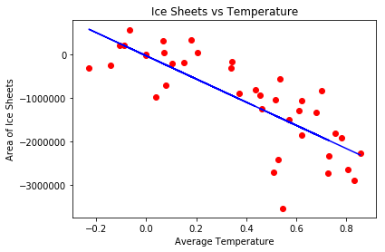
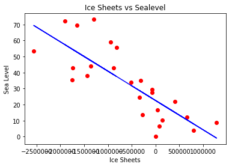

```python
import pandas as pd
import numpy as np
import matplotlib.pyplot as plt
import scipy
df_ice = pd.read_csv("./icesheets.csv")
```


```python
val1979 = df_ice[(df_ice["Year"]==1979)]["IceArea"].values[0]
print ("Value at year 1979 = ", val1979)
df_ice["change"] = df_ice["IceArea"] - val1979
df_ice.to_csv("./icesheets.csv")
```

    Value at year 1979 =  6455322.562999999


```python
df_temp = pd.read_csv('./Temperature.csv')
df_output = pd.DataFrame(columns=["Year","Temperature"])
for year in range(1979,2013):
        tmp = df_temp[(df_temp.year==int(year))].Avg_temp.mean()
        df_output = df_output.append({'Year':str(year),'Temperature':tmp},ignore_index=True)  
df_output.to_csv('./GlobalTempCleaned.csv')        
```


```python
df_temp = pd.read_csv('./GlobalTemp.csv')
val1979 = df_temp[(df_temp["Year"]==1979)]["Temperature"].values[0]
print ("Value at year 1979 = ", val1979)
df_temp["change"] = df_temp["Temperature"] - val1979

df_temp.to_csv("./GlobalTemp.csv")

df_temp['change'].corr(df_ice['change'])
```

    Value at year 1979 =  18.6759500376


    -0.7926009207485141


```python
df_temp = pd.read_csv('./GlobalTemp.csv')
yearList = []
Average_Temperature = []
for year in range(1979,2013):
    yearList.append(year)   
Average_Temperature = df_temp["change"].tolist()    

```


```python
df_ice = pd.read_csv("./icesheets.csv")
Ice_Area = []
Ice_Area = df_ice["change"].tolist()
```


```python
x = np.array(Average_Temperature).reshape(-1, 1)
y = np.array(Ice_Area)
print(x.size)
print(y.size)
```

    39
    39


```python
from sklearn.linear_model import LinearRegression 
regressor = LinearRegression()
regressor.fit(x, y)
```

    /Library/Frameworks/Python.framework/Versions/3.6/lib/python3.6/site-packages/scipy/linalg/basic.py:1226: RuntimeWarning: internal gelsd driver lwork query error, required iwork dimension not returned. This is likely the result of LAPACK bug 0038, fixed in LAPACK 3.2.2 (released July 21, 2010). Falling back to 'gelss' driver.
      warnings.warn(mesg, RuntimeWarning)


    LinearRegression(copy_X=True, fit_intercept=True, n_jobs=1, normalize=False)


```python
plt.scatter(x, y, color= 'red')
plt.plot(x, regressor.predict(x), color = 'blue', label = '')
plt.title ("Ice Sheets vs Temperature")
plt.xlabel("Average Temperature")
plt.ylabel("Area of Ice Sheets")
plt.show()
```





```python
scipy.stats.linregress(df_temp["change"],df_ice["change"])
```


    LinregressResult(slope=-2661822.909846024, intercept=-38291.9292011722, rvalue=-0.7926009207485143, pvalue=1.8190906299864145e-09, stderr=336642.5002614212)


```python
df_ice = pd.read_csv("./icesheets.csv")
theta_0 =  -1000000
theta_cap = df_ice.change.mean()
se = df_ice.change.std()
n = 6.2449979984 #sqrt(39)
se = se/n
se_cap = se
w = (theta_cap - theta_0)/se
print("theta_cap : ",theta_cap)
print("theta_0 : ",theta_0)
print("walds-statistic : ",w)
print("95%% confidence interval %f to %f"%(theta_cap-1.96*se_cap,theta_cap+1.96*se_cap))
```

    theta_cap :  -1033562.0320512813
    theta_0 :  -1000000
    walds-statistic :  -0.1954835776327572
    95% confidence interval -1370068.983771 to -697055.080331


```python

df_ice = pd.read_csv("./icesheets.csv")

val1993 = df_ice[(df_ice["Year"]==1993)]["IceArea"].values[0]

df_ice["change1993"] = df_ice["IceArea"] - val1993

df_ice.to_csv("./icesheets.csv")

df_sea = pd.read_csv("./sealevelrise.csv")

df_sea['gmsl_change'].corr(df_sea['ice_change'])

sea_level = []

sea_level = df_sea["gmsl_change"].tolist()

ice_level = []

ice_level = df_sea["ice_change"].tolist()

x = np.array(ice_level).reshape(-1, 1)
y = np.array(sea_level)

from sklearn.linear_model import LinearRegression 
regressor = LinearRegression()
regressor.fit(x, y)

plt.scatter(x, y, color= 'red')
plt.plot(x, regressor.predict(x), color = 'blue', label = '')
plt.title ("Ice Sheets vs Sealevel")
plt.xlabel("Ice Sheets")
plt.ylabel("Sea Level")
plt.show()

scipy.stats.linregress(df_sea["ice_change"],df_sea["gmsl_change"])
```





    LinregressResult(slope=-1.832087096293542e-05, intercept=22.57569604151481, rvalue=-0.8011402418310739, pvalue=1.4979318571289863e-06, stderr=2.8537824901144324e-06)


