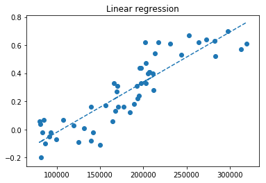

```python
import pandas as pd
tempData = pd.read_csv('./GlobalSurfaceTemp.txt', sep="\t", header=None)
tempData.columns = ["year", "tempChangeA", "tempChangeB"]
justtemp = tempData.set_index("year")
justtemp = justtemp[80:-1]
justtemp = justtemp[justtemp.index<=2012]

justtemp.tail()
```


<div>
<table border="1" class="dataframe">
  <thead>
    <tr style="text-align: right;">
      <th></th>
      <th>tempChangeA</th>
      <th>tempChangeB</th>
    </tr>
    <tr>
      <th>year</th>
      <th></th>
      <th></th>
    </tr>
  </thead>
  <tbody>
    <tr>
      <th>2008</th>
      <td>0.52</td>
      <td>0.62</td>
    </tr>
    <tr>
      <th>2009</th>
      <td>0.63</td>
      <td>0.62</td>
    </tr>
    <tr>
      <th>2010</th>
      <td>0.70</td>
      <td>0.62</td>
    </tr>
    <tr>
      <th>2011</th>
      <td>0.57</td>
      <td>0.63</td>
    </tr>
    <tr>
      <th>2012</th>
      <td>0.61</td>
      <td>0.67</td>
    </tr>
  </tbody>
</table>
</div>


```python
co2data = pd.read_csv('./Co2Data.csv', index_col = "Country Name")
co2data = co2data.drop(["2015","2016","2017"],axis=1)
co2data = co2data.loc[:, ~co2data.columns.str.contains('^Unnamed')]
co2data = co2data.drop("Country Code", axis=1)
co2data = co2data.drop("Indicator Code", axis=1)
co2data = co2data.drop("Indicator Name", axis=1)
co2data = co2data.fillna(method='ffill').fillna(method='bfill')
co2data = co2data.dropna()

for year in range(1960, 2014):
    co2data[str(year)] = co2data[str(year)].astype('int')

co2data.loc['Total']= (co2data.sum()/1000)
co2data = co2data.transpose()
co2data = co2data.loc[:, ['Total']]
co2data.columns = ["Total"]
co2data = co2data.fillna(method='ffill').fillna(method='bfill')
co2data = co2data[:-2]
co2data.tail()
```


<div>
<table border="1" class="dataframe">
  <thead>
    <tr style="text-align: right;">
      <th></th>
      <th>Total</th>
    </tr>
  </thead>
  <tbody>
    <tr>
      <th>2008</th>
      <td>282924.194</td>
    </tr>
    <tr>
      <th>2009</th>
      <td>282487.445</td>
    </tr>
    <tr>
      <th>2010</th>
      <td>297847.399</td>
    </tr>
    <tr>
      <th>2011</th>
      <td>312921.249</td>
    </tr>
    <tr>
      <th>2012</th>
      <td>319459.110</td>
    </tr>
  </tbody>
</table>
</div>


```python
temp = pd.DataFrame()
temp["A"] = justtemp['tempChangeA'].values
temp["B"] = co2data['Total'].values
```


```python
temp.corr()
```


<div>
<table border="1" class="dataframe">
  <thead>
    <tr style="text-align: right;">
      <th></th>
      <th>A</th>
      <th>B</th>
    </tr>
  </thead>
  <tbody>
    <tr>
      <th>A</th>
      <td>1.00000</td>
      <td>0.88919</td>
    </tr>
    <tr>
      <th>B</th>
      <td>0.88919</td>
      <td>1.00000</td>
    </tr>
  </tbody>
</table>
</div>


```python
import scipy.stats
pred_line = scipy.stats.linregress(co2data["Total"], justtemp["tempChangeA"])
print (pred_line)
```

    LinregressResult(slope=3.5646221725232056e-06, intercept=-0.3768583162839198, rvalue=0.8891904270540035, pvalue=5.979146036241749e-19, stderr=2.568385126844722e-07)


```python
import matplotlib.pyplot as plt
import numpy as np
y = justtemp['tempChangeA'].values
x = co2data['Total'].values
predy = [(pred_line.slope*xval + pred_line.intercept) for xval in x]
plt.plot(x, predy, '--')
plt.scatter(x, y)
# plt.plot(x, abline_values, 'b')
plt.title("Linear regression")
plt.show()
```




